# Code of Conduct

## The short version

This project exists to help people learn something genuinely difficult. Nobody
arrives knowing it. Behave in a way that makes it easier for the next person to
ask a question they are worried sounds stupid.

## Expected behaviour

- Assume good faith. A confused question is not a waste of anyone's time.
- Be specific and kind in review. Critique the code, not the person.
- Accept that people come from different backgrounds, languages, levels of
  mathematical training, and amounts of free time.
- Correct mistakes, including your own, without drama.

## Unacceptable behaviour

- Harassment, insults, or personal attacks of any kind.
- Discriminatory language or imagery, including sexualised language, and unwelcome
  attention of any sort.
- Publishing others' private information without explicit permission.
- Condescension aimed at beginners. "Everyone knows that" has no place here.

## Scope

This applies in the issue tracker, in pull requests, in commit messages, and
anywhere someone is representing the project.

## Reporting

Report problems to contact@tuguidragos.com. Reports are handled confidentially.
The maintainer will respond as promptly as circumstances allow, and may edit,
remove, or reject contributions, or ban a contributor, for behaviour covered
above.

## Attribution

This document is adapted in spirit from the
[Contributor Covenant](https://www.contributor-covenant.org), version 2.1,
available at https://www.contributor-covenant.org/version/2/1/code_of_conduct/.
