# Contributing

## Setup

```bash
git clone https://github.com/TuguiDragos/quantum-exercises
cd quantum-exercises
uv sync --all-extras --dev
uv run pre-commit install
```

`uv run pytest` should be green before you start.

## The dependencies

Nine runtime dependencies. `pyproject.toml` declares a tested range for each,
and the committed `uv.lock` pins exact versions, so `uv sync` reproduces this
environment byte for byte.

The right-hand column is what the lockfile resolves to **on Python 3.13**, the
default interpreter. It is not universal: older interpreters resolve some
packages lower, because newer releases drop support for them. On 3.10 numpy
resolves to 2.2.6 and scipy to 1.15.3. A test keeps this table in step with a
3.13 environment and skips elsewhere.

| Dependency | Range | On 3.13 | Why it is here |
|---|---|---|---|
| [qiskit](https://pypi.org/project/qiskit/) `[visualization]` | `>=2.5,<3` | 2.5.1 | the SDK itself. The extra adds matplotlib, pydot, Pillow, pylatexenc, seaborn and sympy, which plain `qiskit` does not install and `draw("mpl")` needs |
| [qiskit-ibm-runtime](https://pypi.org/project/qiskit-ibm-runtime/) | `>=0.48,<1` | 0.48.0 | talks to IBM hardware, and supplies the fake backends the offline noise model is copied from |
| [qiskit-aer](https://pypi.org/project/qiskit-aer/) | `>=0.17,<1` | 0.17.2 | local simulation, including noise models taken from real devices |
| [typer](https://pypi.org/project/typer/) | `>=0.27,<1` | 0.27.1 | the `qx` command and its subcommands |
| [rich](https://pypi.org/project/rich/) | `>=15,<16` | 15.0.0 | histograms, matrices and panels in the terminal |
| [watchfiles](https://pypi.org/project/watchfiles/) | `>=1.2,<2` | 1.2.0 | `qx watch`, which re-runs an exercise on save |
| [numpy](https://pypi.org/project/numpy/) | `>=2.0,<3` | 2.5.1 | imported directly by the verification code, so it is declared rather than inherited from Qiskit |
| [scipy](https://pypi.org/project/scipy/) | `>=1.14` | 1.18.0 | chi-square critical values for the distribution checks |
| [tomli](https://pypi.org/project/tomli/) | `>=2.0.1` | 3.10 only | reads `meta.toml`. Conditional: `tomllib` is in the standard library from 3.11, so this is installed only on 3.10 |

Development, installed by `uv sync` and not needed to take the course:

| Dependency | Range | On 3.13 | Why it is here |
|---|---|---|---|
| [pytest](https://pypi.org/project/pytest/) | `>=9,<10` | 9.1.1 | the test suite |
| [ruff](https://pypi.org/project/ruff/) | `>=0.16,<0.17` | 0.16.1 | linting and formatting, including the notebooks |
| [pre-commit](https://pypi.org/project/pre-commit/) | `>=4,<5` | 4.6.1 | runs the lint, format, notebook and secret-scan hooks before each commit |
| [nbstripout](https://pypi.org/project/nbstripout/) | `>=0.9,<1` | 0.9.1 | strips notebook outputs, which can carry IBM job ids |
| [ipykernel](https://pypi.org/project/ipykernel/) | `>=7,<8` | 7.3.0 | the kernel the notebooks run on |

Counting everything those pull in, `uv.lock` records 122 package entries. That is
not the size of any one environment: the lockfile carries a separate entry per
resolution, so numpy, scipy and six others appear more than once. It names 112
distinct packages, and a 3.13 environment ends up with 105 installed.
Two more tools are fetched by pre-commit and CI rather than installed into the
environment: [gitleaks](https://github.com/gitleaks/gitleaks) 8.30.1 for secret
scanning, and the hooks from
[pre-commit-hooks](https://github.com/pre-commit/pre-commit-hooks) 6.0.0.

Python 3.10 or newer, which is the same floor Qiskit sets. CI runs the suite on
3.10, 3.11, 3.12, 3.13 and 3.14; `uv` installs 3.13 by default.

## Adding an exercise

Create one directory under `exercises/`. There is no central index to update:
ordering comes from the numeric prefix, and the test suite enforces everything
else.

```
exercises/18_your_topic/
├── meta.toml       # title, act, summary; optional hardware and timeout
├── README.md       # the teaching text
├── exercise.py     # what the learner edits
├── template.py     # pristine copy of exercise.py, used by `qx reset`
├── solution.py     # reference answer
├── check.py        # verification, exposing check(mod)
└── hints.md        # exactly three `## Hint N` sections
```

`template.py` starts as a byte-identical copy of `exercise.py`:

```bash
cp exercises/18_your_topic/exercise.py exercises/18_your_topic/template.py
```

### Writing `check.py`

`check(mod)` receives the learner's module. Raise `CheckFailed` to reject an
answer, return an `Artifact` or a list of them to show on success.

```python
from quantum_exercises.checks import assert_state_equiv, require_circuit, statevector_artifact


def check(mod):
    qc = require_circuit(mod, "qc")
    state = assert_state_equiv(qc, TARGET, message="Your circuit does not prepare ...")
    return statevector_artifact(state, caption="Your state")
```

Two rules the test suite will not let you break. Both are checked by walking the
syntax tree of every `check.py`, in `tests/test_exercises.py`:

1. **Compare objects, never source text.** Use `assert_state_equiv` and
   `assert_operator_equiv`, which go through `.equiv` and therefore ignore global
   phase. An answer that is right in an unexpected way must still pass.
2. **Never assert exact counts.** Use `assert_counts_support` for which outcomes
   are possible, `assert_counts_close` for proportions at 4 sigma, or
   `assert_counts_distribution` for a chi-square test over the whole distribution.

There is exactly one exception to the first rule, and it is named in the test:
`01_environment` reads the learner's file. That exercise is about asking the
package for its version rather than typing the number in, and both routes produce
the same string, so no object inspection can tell them apart. If you need a
second exception, you almost certainly want a different exercise instead.

Artifacts cross a process boundary as JSON, so their payloads must be
JSON-serializable. The helpers in `checks.py` already handle that for states,
matrices and counts.

### Error messages

Say what is wrong in the language of the problem, then how to fix it. Compare:

> `AttributeError: 'PrimitiveResult' object has no attribute 'get_counts'`

with

> `result.get_counts()` is the old V1 API and no longer exists. A V2 result is a
> list of per-circuit results.

New translations go in `errors.py`. **Trigger the real exception first and paste
its actual message** - never write a pattern from memory. `tests/test_errors.py`
raises each error for real, so a guessed pattern fails immediately.

## The notebooks

Everything in `notebooks/` is executed cell by cell in CI, so treat it as code: if
you change an API it uses, the suite tells you. The test is parametrised over the
directory, so a new notebook is covered the moment it lands, and
`tests/test_notebook.py` names the ones that must exist so a rename cannot quietly
drop one from the suite.

Outputs are stripped on commit by nbstripout, which matters because notebook
output can carry IBM job ids and account details.

Labs are not graded and must run offline. If a cell needs a real QPU, it belongs
in a fenced markdown block showing the code rather than in a cell that runs.

## Releasing

The version appears in **four** files, and tests enforce that they agree:

- `pyproject.toml`
- `src/quantum_exercises/__init__.py`
- `CITATION.cff`
- `uv.lock`, which records this project as a package like any other

The fourth is the one that bites. Editing the first three and stopping leaves the
lockfile behind, and then every CI job that runs `uv sync --locked` refuses to
start, for a reason nothing in the diff points at. So after bumping:

```bash
uv lock
```

It rewrites one line. Add the change to `CHANGELOG.md` in the same commit.

## What CI checks

For every exercise:

- `solution.py` passes its own check
- `template.py` fails, so the exercise teaches something
- the solution produces at least one artifact
- there are exactly three hints
- `meta.toml` is complete

`ci.yml` has three jobs. `test` runs the suite once per interpreter in the matrix.
`lint` runs `ruff check` and `ruff format --check` as two steps on 3.13. `secrets`
runs gitleaks over the tree and uses no Python at all.

The triggers are every pull request and every push to `main`. A push to a side
branch runs nothing until a pull request exists for it.

`weekly-verify.yml` has three jobs on two cadences. `latest` resolves to the
newest Qiskit the version ranges allow and runs everything again, weekly: it is
the early warning for a breaking release, which is why dependencies are ranges
rather than exact pins even though `uv.lock` is committed, and it writes the
version it tested to the run summary. `preview` installs over the `<3` ceiling
those ranges impose, because the release most likely to break an exercise is the
one `latest` cannot see; it is quiet until a 3.x exists and never reddens the
badge. `locked` installs the exact versions in `uv.lock` across three operating
systems, monthly, because pinned versions do not change week to week.

Three tests assert that the installed environment is the one the documentation
describes. They are true of a locked install and false by construction in a job
that installs something newer on purpose, so `latest` and `preview` deselect them
through `PYTEST_ADDOPTS`. Without that, the first Qiskit patch release turns the
badge red over a stale badge rather than a broken exercise.

One thing to watch: GitHub disables a scheduled workflow in a public repository
after 60 days with no repository activity, and emails the owner when it does. Any
commit re-arms it, and the workflow can be re-enabled from the Actions tab.
`rotate-notes.yml` is what keeps the clock from getting close: it rewrites the
block between the NOTES markers in the README every Monday and commits the
result. It is the only workflow here with `contents: write`, and the only one
that changes anything in the repository.

Those titles arrive from a feed rather than from this repository, so the block
between the markers is exempt from the two tests that scan written files for a
bare string, and a square bracket in a title is escaped rather than trusted. A
commit pushed with `GITHUB_TOKEN` creates no workflow run, so nothing checks the
rotation at the moment it lands; without both guards a post title could sit in
the README until an unrelated pull request failed for it.

## Never in CI, never in tests

Nothing may submit a job to real hardware. `ci.yml` and `weekly-verify.yml` set
`QX_OFFLINE=1` and `tests/conftest.py` sets it for the whole session. A test that
spends someone's free QPU quota is a bug. `rotate-notes.yml` runs no Python and
touches nothing quantum.

## Before opening a pull request

```bash
uv run pre-commit run --all-files
uv run pytest
```
