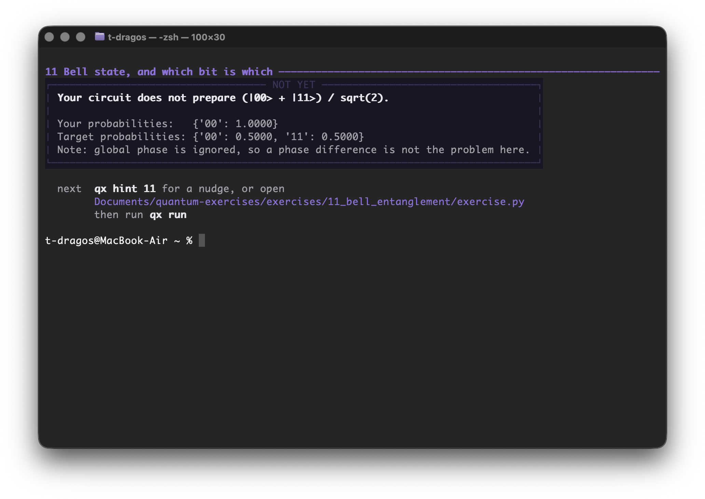
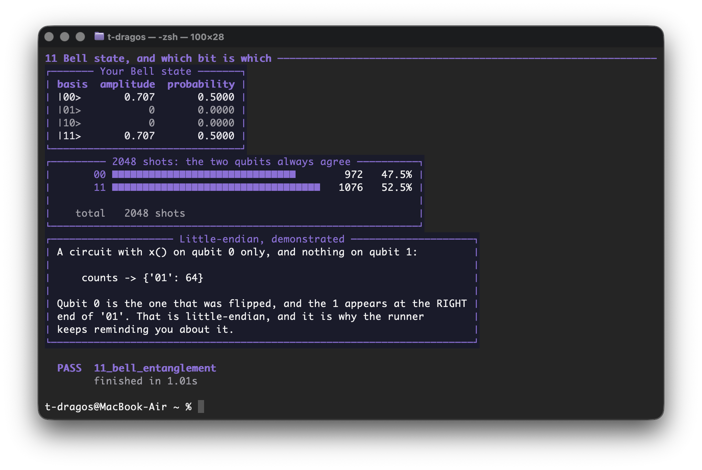
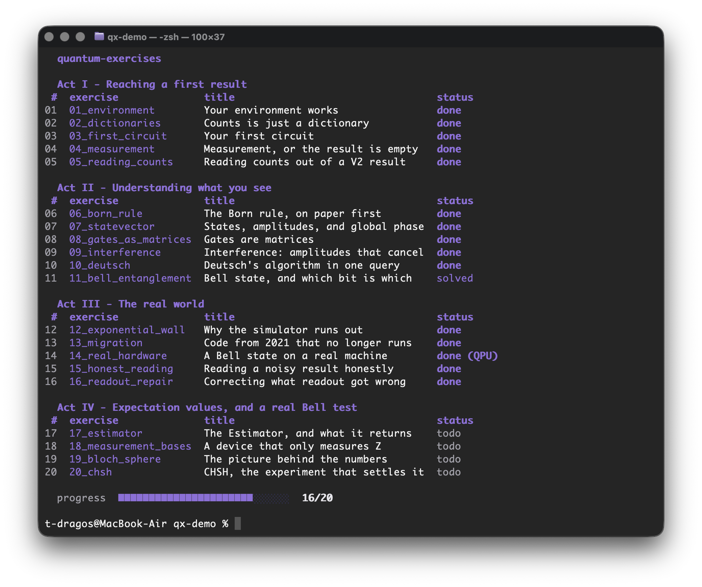
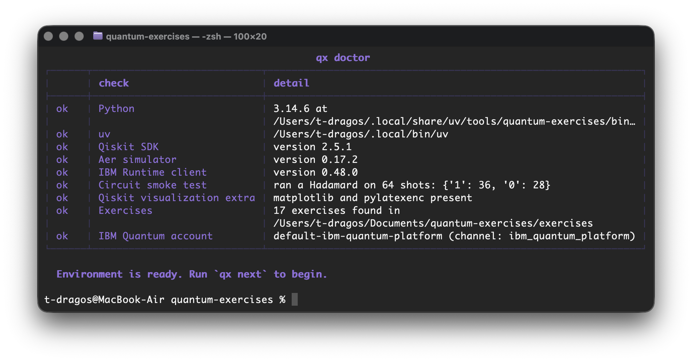
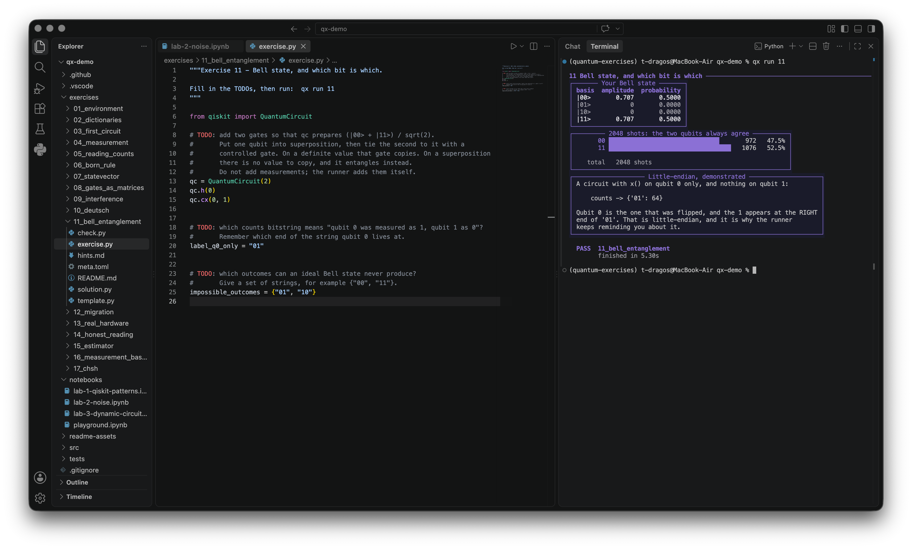
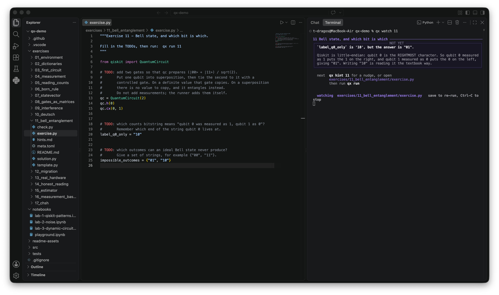
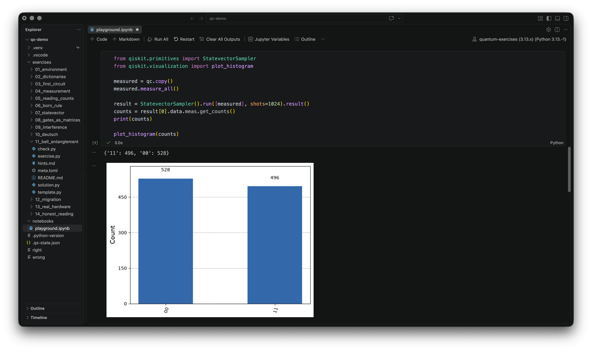

# quantum-exercises

[](https://github.com/TuguiDragos/quantum-exercises/actions/workflows/ci.yml)
[](https://github.com/TuguiDragos/quantum-exercises/actions/workflows/weekly-verify.yml)

[](https://www.python.org/)
[](https://pypi.org/project/qiskit/)
[](https://pypi.org/project/qiskit-ibm-runtime/)
[](https://pypi.org/project/qiskit-aer/)
[](https://github.com/astral-sh/uv)
[](https://github.com/astral-sh/ruff)
[](LICENSE)

Fourteen hands-on exercises that take you from an empty laptop to a quantum
circuit running on real IBM hardware.

You edit a file, you run one command, and it tells you exactly what is wrong in
the language of the problem rather than as a Python traceback.

## What it looks like

### You get something wrong



That is the whole idea. No traceback, no line number pointing at library code, no
guessing. The runner knows which concept you tripped over, so it explains the
concept.

### You fix it, and something actually runs



No exercise ends on a green tick alone. Each one finishes with a state, a matrix
or a histogram that your own code produced, because seeing the object is the
point.

### You always know where you are



## Why this exists

Nearly every quantum computing tutorial on the internet was written for Qiskit
0.x, and none of it runs any more. `execute()` was removed, `Aer` moved to its
own package, `IBMQ` became a different thing entirely, and the way you read your
results changed shape completely.

So beginners hit an `ImportError` on line 3 and conclude they are not smart
enough for quantum computing. They were just reading instructions for software
that no longer exists.

The nearest thing to this project, Microsoft's Quantum Katas, has been archived
read-only since August 2024, and it teaches Q# rather than Qiskit.

Everything here is verified weekly against the Qiskit that actually ships today,
not against the version this was written for. Every reference solution is re-run,
and the run reports which version it tested. If a new Qiskit release breaks an
exercise, the weekly-verify badge above turns red.

## Who this is for

You need to be able to read and write basic Python: variables, functions, and
dictionaries. Exercise 02 covers the dictionary part, because measurement results
arrive as a plain `dict` and that trips people up more often than the physics.

You need **no** quantum background, and no linear algebra beyond multiplying a
small matrix by a vector. Where a matrix shows up, the runner prints it.

Act I takes well under an hour. The whole course is an afternoon or two,
depending on how much you stop to poke at things.

## Installation

### 1. Install uv

[uv](https://docs.astral.sh/uv/) is the only prerequisite. It fetches the right
Python itself, so you do not need Python installed first.

macOS and Linux:

```bash
curl -LsSf https://astral.sh/uv/install.sh | sh
```

Windows, in PowerShell:

```powershell
powershell -ExecutionPolicy ByPass -c "irm https://astral.sh/uv/install.ps1 | iex"
```

If `uv` is not found afterwards, open a new terminal so the updated PATH takes
effect.

### 2. Clone and install

```bash
git clone https://github.com/TuguiDragos/quantum-exercises
```

```bash
cd quantum-exercises
```

```bash
uv tool install --editable .
```

That last command takes about a second. It builds the environment from the
committed lockfile and puts `qx` on your PATH, so every command below works from
any directory. `--editable` keeps it pointed at this clone, so it follows your
edits and finds the exercises wherever you run it from.

### 3. Check that it worked

```bash
qx doctor
```



Every check names the problem and the fix when something is wrong. The circuit
smoke test actually builds a Hadamard and samples it, so an install that imports
but cannot execute is caught here rather than three exercises later.

An IBM Quantum account is **optional**. Every exercise runs on a local simulator
without one.

### 4. Start

```bash
qx next
```

That prints the first unfinished exercise and the path to the file you edit. Open
that file, fill in the TODOs, save, and run `qx run`.

## The commands

| Command | What it does |
|---|---|
| `qx doctor` | check the environment, step by step |
| `qx list` | every exercise and your progress |
| `qx next` | the next thing to work on |
| `qx run [n]` | check an exercise |
| `qx watch [n]` | re-check automatically every time you save |
| `qx hint [n]` | reveal one more hint |
| `qx solution [n]` | show the answer, recorded as solved rather than done |
| `qx reset [n]` | restore an exercise to its starting state |
| `qx version` | versions of the tool and the quantum stack |

Leave the number off and the command picks the first exercise you have not
finished. Numbers, slugs and fragments all work, so `qx run 11`, `qx run bell`
and `qx run 11_bell_entanglement` are the same thing.

If you skipped the install step, everything still works as `uv run qx <command>`
from inside the repository, and the tool prints whichever form applies to you.

## The fourteen exercises

**Act I - reaching a first result**

| # | Exercise | What you come away with |
|---|---|---|
| 01 | Your environment works | Prove the toolchain is real, and learn the one attribute worth printing when a tutorial misbehaves |
| 02 | Counts is just a dictionary | Measurement results are a plain `dict`. Write the three helpers you will reuse all course |
| 03 | Your first circuit | Build a one-qubit circuit and see the matrix it represents |
| 04 | Measurement, or the result is empty | Forget the measurement and Qiskit hands you nothing, without raising an error. Meet that trap on purpose |
| 05 | Reading counts out of a V2 result | `result.get_counts()` is gone. Learn the three-step path that replaced it |

**Act II - understanding what you see**

| # | Exercise | What you come away with |
|---|---|---|
| 06 | The Born rule, on paper first | Predict the probabilities before running anything, checked against 4096 real shots |
| 07 | States, amplitudes, and global phase | Prepare two target states, and find out why the runner compares with `equiv` rather than `==` |
| 08 | Gates are matrices | Build a controlled-Z out of nothing but Hadamards and a CNOT |
| 09 | Interference: amplitudes that cancel | Two Hadamards undo each other, which no coin can do. This is where the power comes from |
| 10 | Deutsch's algorithm in one query | Turn that cancellation into the first algorithm that provably beats every classical one |
| 11 | Bell state, and which bit is which | The state that started the argument, plus which character of the bitstring is qubit 0 |

**Act III - the real world**

| # | Exercise | What you come away with |
|---|---|---|
| 12 | Code from 2021 that no longer runs | Migrate real 0.x code to 2.x. This is the skill that unblocks every old tutorial you will ever find |
| 13 | A Bell state on a real machine | Transpile to the backend's instruction set and run, on a QPU if you have one |
| 14 | Reading a noisy result honestly | Hardware gives outcomes the theory forbids. Quantify that instead of assuming your circuit is broken |

## How answers are checked

Not by comparing your code to the solution. The runner inspects the objects your
code produces:

- **states** with `Statevector.equiv`, which ignores global phase, because no
  experiment can detect it
- **gates** with `Operator.equiv`, same reasoning
- **measurement counts** never for exact equality. Sampling is random.
  Proportions are checked against the binomial standard error
  `SE = sqrt(p(1-p)/N)` at a 4-sigma tolerance, and whole distributions with a
  chi-square test

So an answer that is right for reasons the author did not anticipate still
passes, and an answer that only looks right does not.

Your file runs in a separate process with a time limit, so an infinite loop or a
crash costs you one run rather than your terminal session.

## Working in an editor

Open the repository folder and you get the exercise on one side and the verdict
on the other.

```bash
code .
```



The `.vscode` settings in this repository point the Python extension at the
project's own environment, so the interpreter is right from the first open.

Editing and rerunning by hand gets old quickly, so there is a watch mode:

```bash
qx watch
```



It re-runs on every save and moves to the next exercise on its own when one
passes.

## The playground notebook

`notebooks/playground.ipynb` is the other half of learning: nothing there is
graded, and you are meant to change numbers and see what moves. CI executes every
cell, so it cannot quietly rot.



In VS Code the notebook kernel is a **separate** setting from the Python
interpreter. If `qx doctor` passes but the notebook cannot import qiskit, that is
the cause: pick the kernel inside `.venv` from the picker in the top right.

## Running on real hardware

Exercise 13 is the only one that can reach out to IBM, and it degrades
gracefully:

1. a real QPU, if you have an account and one is reachable
2. a local simulator with a **noise model copied from real hardware**, so the
   lesson about noise still lands
3. a plain noiseless simulator

Whichever it used is printed with the result and recorded in `qx list`.


Those `01` and `10` shots are the point of the exercise that follows. An ideal
Bell state forbids them; a real machine produces them anyway, and exercise 14 is
about quantifying that instead of assuming your circuit is broken.

To set up an account:

```bash
qx doctor --save-account
```

Qiskit stores the key unencrypted at `~/.qiskit/qiskit-ibm.json`, outside this
repository, so it cannot be committed by accident, and `qx` tightens the file to
be readable only by you.

To force the offline path even when you do have an account:

```bash
QX_OFFLINE=1 qx run 13
```

CI always sets `QX_OFFLINE`, so no automated run can ever spend your free QPU
minutes.

## Contributing

See [CONTRIBUTING.md](CONTRIBUTING.md). Adding an exercise means creating one
directory; the test suite enforces the rest. The full dependency inventory, with
the reason each one is present, lives there too.

## Security

Reporting, and what the tool does with your IBM API key, are in
[SECURITY.md](SECURITY.md). The short version: an account is optional, the key
never reaches this repository, and `qx run` executes `check.py` from whichever
copy you cloned, so clone from a source you trust.

## Author

Tugui Dragos, [tuguidragos.com](https://tuguidragos.com).

If you use this project in written work, [CITATION.cff](CITATION.cff) has the
metadata; GitHub turns it into a formatted citation from the sidebar.

## License

MIT. See [LICENSE](LICENSE).

Qiskit is a trademark of IBM. This project is not affiliated with or endorsed by
IBM. It is an independent set of exercises that happens to be written for Qiskit,
which is why neither the project name nor the command contains "Qiskit" or "IBM".
