# Security

## Reporting a vulnerability

Email **contact@tuguidragos.com**. Please do not open a public issue for
anything that could expose someone's credentials.

Include what you did, what happened, and what you expected. A proof of concept
helps but is not required. You will get an acknowledgement within a few days.

GitHub's private vulnerability reporting is also enabled on this repository, and
either route reaches the same person.

## What is supported

The latest commit on `main`. This is a course rather than a deployed service, so
there are no maintained release branches: if something needs fixing, it is fixed
on `main` and you pull.

## What this project touches

Two things are worth understanding before you clone it.

### 1. It can hold a long-lived IBM Quantum API key

Only if you ask it to. Every exercise runs on a local simulator without an
account, and `qx doctor --save-account` is the only command that writes one.

When you do use it:

- The key is stored by qiskit at `~/.qiskit/qiskit-ibm.json`, **in clear text**.
  That location is qiskit's, not this project's, and it sits outside the
  repository so it cannot be committed by accident.
- `qx` creates that file at `0600`, inside a `0700` directory, **before** the key
  is written into it. This ordering is the whole point. qiskit creates the file
  with whatever umask happens to be in force, normally world-readable, and only
  then writes the key, so tightening it afterwards would leave a window in which
  the key sits on disk readable by anyone with a local account. Opening a file
  that already exists does not change its mode, so creating it first closes that
  window rather than narrowing it. The permissions are checked again after saving.
- `qx doctor` warns when the file is readable by other local users, which catches
  accounts saved before this tool existed or saved by qiskit directly.
- The key is read without terminal echo. If the terminal cannot suppress echo,
  `qx` refuses to continue rather than printing it.
- No command prints the key, the instance CRN, or the file's contents. `qx
  doctor` reports the account label and channel only.

If you believe a key was exposed, revoke it at
<https://cloud.ibm.com/iam/apikeys>, where it was created, and save a new one.

### 2. It executes Python from the course you are working in

This is the part worth thinking about, because it is not obvious.

`qx run` imports two files: your `exercise.py`, and the exercise's `check.py`.
With `--solution` the first of those is the exercise's `solution.py` instead, which
is repository code like `check.py`. Both run as ordinary Python in a child
process. That child inherits your environment, your filesystem and your network
access. It is **not a sandbox**, and it is not trying to be: `exercise.py` is
code you wrote yourself, and `check.py` is repository code reviewed like any
other source file.

The consequence: **a `check.py` from a repository you clone can read
`~/.qiskit/qiskit-ibm.json` and send it anywhere.** Verified, not theoretical.

Where those files came from depends on how you installed. `qx init` copies them
out of the wheel you installed from PyPI, so they are the ones this project
published through trusted publishing, with no long-lived token anywhere in the
chain. That is not the same as a signature: no attestation is uploaded, so there
is nothing for you to verify locally. A clone gives you whatever that clone
contains, which is the same thing when it came from here and is not when it came
from a fork.

So treat the course you are about to run the way you would treat any other code:

- Install from PyPI, or clone from
  <https://github.com/TuguiDragos/quantum-exercises>, rather than from a fork you
  have not read.
- If you do use a fork, read its `exercises/*/check.py` first. They are short.
- `qx init` never overwrites, so it cannot quietly replace a `check.py` you have
  already looked at. It only ever adds what is missing, and says what it added.
  `qx init --refresh` does replace lesson files, which is the point of it, and it
  cannot do so quietly either: whatever was there is copied aside with a `.bak`
  suffix and every replaced file is named on screen. Read those names if you did
  not fetch the update yourself.
- On a shared machine, or if you would rather not have the key reachable at all,
  run with `QX_OFFLINE=1` and skip `qx doctor --save-account` entirely. The whole
  course works that way.

The child process is hardened against accidents rather than against malice:

- a time limit, enforced by the parent, and the child is killed whenever the parent
  unwinds, Ctrl-C included, so an interrupted run does not leave the loop spinning.
  A `kill -9` of `qx` itself still orphans the child, because nothing survives that
  to do the cleaning up
- a bounded output buffer, and a bounded verdict file, so neither a runaway printer
  nor an enormous exception message can grow the parent's memory
- its own process group, so a timeout takes anything the exercise spawned with it
- no stdin, so exercise code cannot eat what you type
- no working directory on `sys.path`, compared by real path, so a stray `qiskit.py`
  in the repository root cannot shadow the real module even through a symlink

Those stop a runaway loop or a misnamed file from breaking your session. None of
them stop deliberate code.

## What is not a vulnerability

- **The worker is not a sandbox.** Reported above, by design, and documented in
  `src/quantum_exercises/worker.py`. If you want isolation, run the course in a
  container or a virtual machine.
- **The API key is stored in clear text.** That is qiskit's storage format, not
  this project's choice. What is in scope is the file's permissions and anything
  this tool prints, both covered above.
- **`qx solution` reveals answers.** It is a teaching tool, not an exam.

## Keeping secrets out of the repository

An IBM Quantum API key is 44 generic alphanumeric characters. GitHub's push
protection does not recognise that shape, and neither does gitleaks out of the
box: a hardcoded key passes the default rule set untouched, which was verified
rather than assumed.

So the repository carries its own rule in
[`.gitleaks.toml`](.gitleaks.toml), which matches a key-shaped string assigned to
a token-like name, and it runs in two places:

- **pre-commit**, on staged changes, for anyone who ran `pre-commit install`
- **CI**, over the whole tree on every pull request and on every push to `main`,
  because installing hooks is opt-in and easy to skip. A push to a side branch with
  no pull request open is the one path neither covers

The rule also allows for a backslash before the quote, which is what makes it work
inside a notebook. A `.ipynb` stores cell source as a JSON string, so `token="..."`
sits on disk as `token=\"...\"`, and a rule anchored to a bare quote never sees it.
That matters because the README points readers at `notebooks/playground.ipynb` as
the place to experiment, which makes it the likeliest place in this repository for
a key to be pasted. `tests/test_packaging.py` exercises the rule against both
spellings so an edit cannot quietly undo it.

Notebook outputs are stripped by `nbstripout` on commit, since a cell that ran
against hardware can carry job identifiers.

## Automated runs never reach hardware

`ci.yml` and `verify.yml` set `QX_OFFLINE=1`, and so does the test suite.
Nothing automated can submit a job or spend someone's free QPU minutes.
`rotate-notes.yml` runs no Python and never loads qiskit at all.

That is the outer guard. The inner one does not depend on remembering to set
anything: the parent hands the child an offline environment for any run of
exercise 14 that reached no one to ask, and `qx run` is the only caller that can
ask at all. A run with no terminal, and `qx watch`, which asks nothing on any
run, both stay on the local simulator and say so. A scripted `qx run 14` on a
machine with a saved account therefore spends nothing, which before this was
exactly how a stray editor task could have joined a real queue.

The awkward case is the interactive run whose queue cannot be read at all. There
is nothing to show and so no question to put, and a failed check is not consent,
so the run stays on the local simulator and says so, naming
`qx doctor --online` as the way to find out whether IBM is reachable at all. It
fails closed: reading a failed peek as a yes once meant the last line on screen
was "this sends no job" and then a job went out.

That third workflow is the only one here holding `contents: write`. It rewrites
the block between the NOTES markers in `README.md` from the author's public feed
and commits the result, and it can change nothing else: the permission is granted
on the job rather than the workflow, and every other job in this repository is
read-only.
